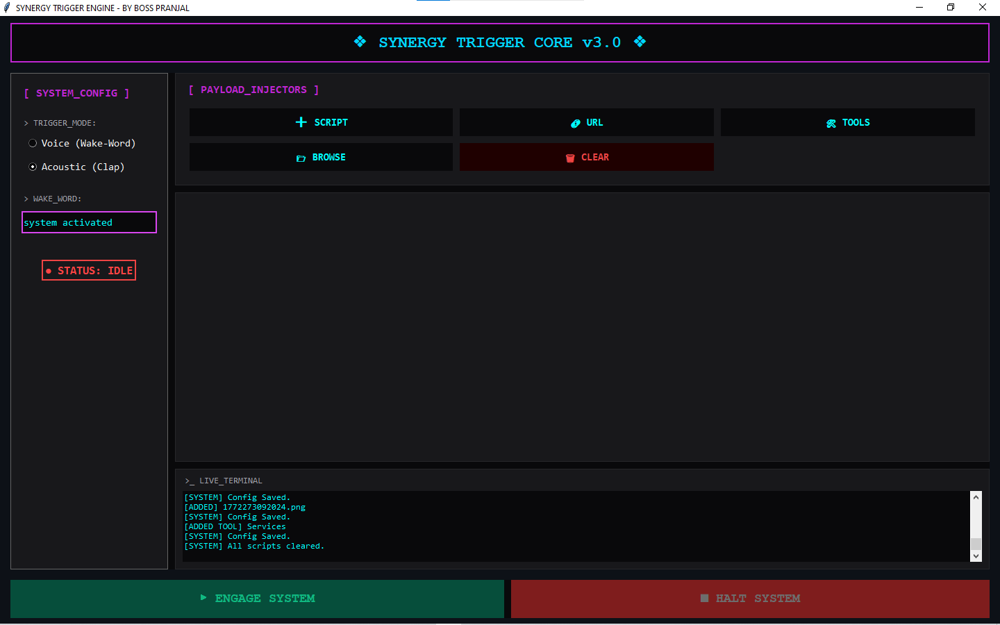

# 🔥 SYNERGY TRIGGER ENGINE

An AI-powered automation system that executes predefined actions using voice commands or clap triggers.

---

---
## 🎥 Demo

[Watch Demo](synergy-demo.mp4)

## 🚀 Features

- 🎤 Voice command activation  
- 👏 Clap detection trigger  
- ⚡ Instant launch of apps, files, and websites  
- 🤖 Smart automation logic  
- 🧠 Designed for speed and efficiency  

---

## 🛠️ Tech Used

- Python  
- Automation scripts  
- AI-based logic  

---

## ▶️ How It Works

1. System listens for trigger (voice/clap)  
2. Recognizes command  
3. Instantly executes predefined actions  

---

## 💡 Use Case

- Open multiple apps instantly  
- Automate daily workflows  
- Create a personal AI assistant environment  

---

## 👤 Author

Pranjal  
AI Builder | Automation Developer
